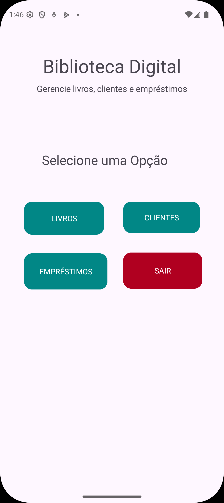

# 💻 Sistema de Controle de Biblioteca

Aplicativo Android desenvolvido em Java para gerenciamento de livros, clientes e empréstimos.

---

## 🚀 Funcionalidades

- 📚 Cadastro de livros  
- 📖 Listagem de livros cadastrados  
- 👤 Cadastro de clientes  
- 👥 Listagem de clientes  
- 🔄 Registro de empréstimos  
- 📋 Visualização de empréstimos  

---

## 📱 Screenshots

### 🏠 Menu Principal

### 📚 Cadastro de Livros

### 📖 Livro Cadastrado

### 👤 Cadastro de Clientes

### 👥 Cliente Cadastrado

### 🔄 Tela de Empréstimos

### 📋 Resultado do Empréstimo

---

## 🛠️ Tecnologias Utilizadas

- Java  
- Android Studio  
- XML (Layouts)  

---

## 🎯 Objetivo do Projeto

Este projeto foi desenvolvido como parte de uma atividade acadêmica (APS), com o objetivo de praticar:

- Lógica de programação  
- Programação orientada a objetos  
- Manipulação de dados em memória (ArrayList)  
- Navegação entre telas no Android  

---

## 📌 Observações

- Os dados são armazenados em memória (sem banco de dados)  
- Projeto inicial (versão piloto)  
- Futuras melhorias incluirão:
  - Integração com banco de dados  
  - Sistema de login  
  - Filtros de busca  
  - Melhorias na interface  

---

## 👨‍💻 Autores
José Gabriel Ferreira Batista da Cruz
🔗 LinkedIn: https://www.linkedin.com/in/josegabrielcruz/

João Pedro Moro
🔗 LinkedIn: (https://www.linkedin.com/in/joao-moro-a099763bb/)

Henrique Herrero Vido
🔗 LinkedIn: (https://www.linkedin.com/in/henrique-vido-414b813aa/)
