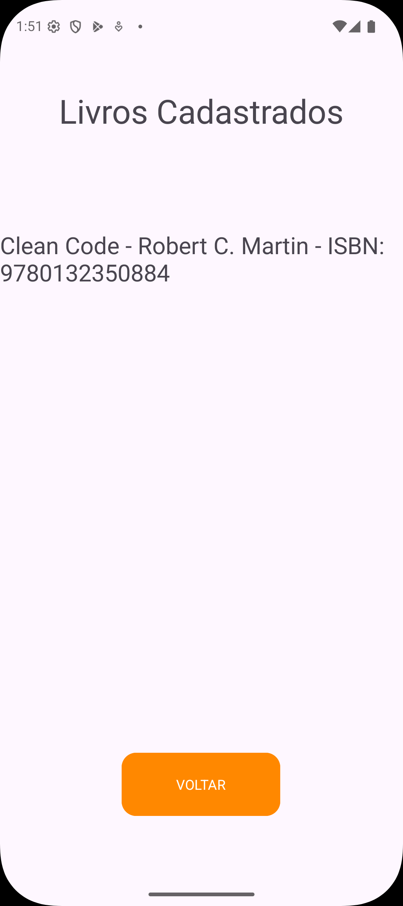
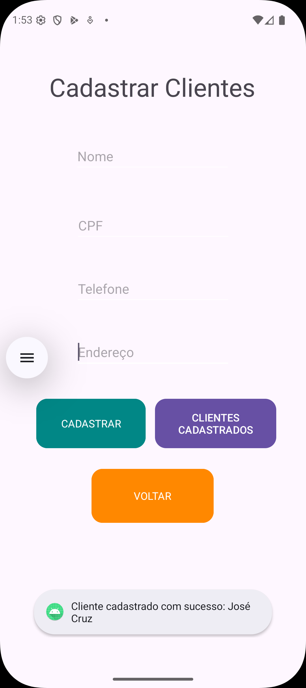
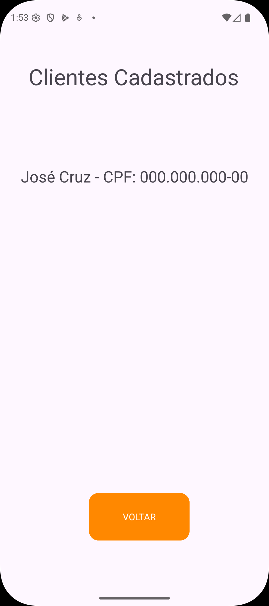
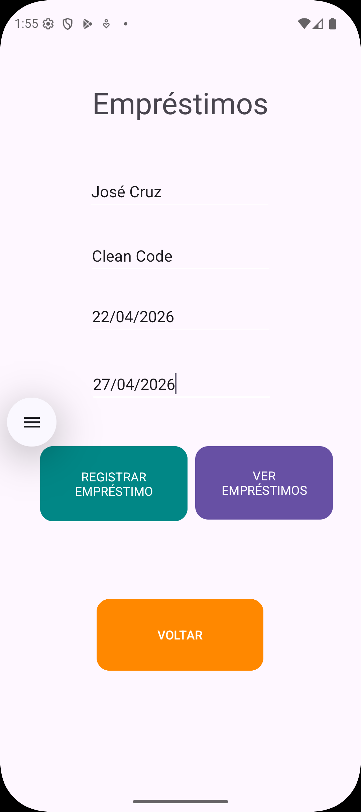
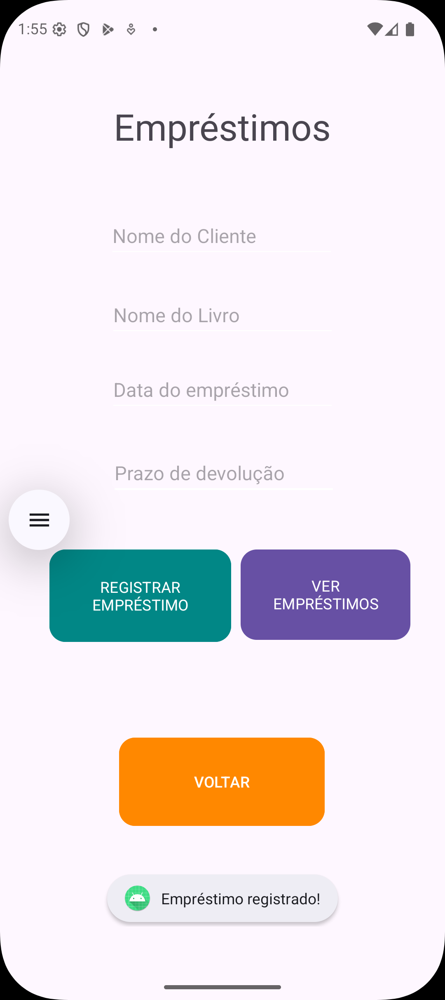

# 💻 Sistema de Controle de Biblioteca

Aplicativo Android desenvolvido em Java para gerenciamento de livros, clientes e empréstimos, simulando um sistema real de controle de biblioteca.

Projeto acadêmico desenvolvido na APS (Atividade Prática Supervisionada) com foco na prática de lógica de programação, estruturação de sistemas e navegação entre telas.

---

## 🚀 Funcionalidades

* 📚 Cadastro de livros
* 📖 Listagem de livros cadastrados
* 👤 Cadastro de clientes
* 👥 Listagem de clientes
* 🔄 Registro de empréstimos
* 📋 Visualização de empréstimos

---

## 📱 Screenshots

  
  
  

  
  
  

  

---

## 🧱 Estrutura do Projeto

* Activities separadas por funcionalidade
* Navegação entre telas utilizando **Intent**
* Armazenamento de dados em memória com **ArrayList**

---

## 🛠️ Tecnologias Utilizadas

* Java
* Android Studio
* XML (Layouts)

---

## 🎯 Objetivo do Projeto

Aplicar conceitos fundamentais de desenvolvimento de software, incluindo:

* Lógica de programação
* Programação orientada a objetos
* Organização de dados
* Desenvolvimento de aplicações Android

---

## 📌 Observações

* Os dados são armazenados em memória (sem banco de dados)
* Projeto inicial (versão piloto)
* Evolução prevista para APS 2:

  * Integração com banco de dados
  * Sistema de autenticação (login)
  * Filtros de busca
  * Melhorias na interface

---

## 👨‍💻 Autores

**José Gabriel Ferreira Batista da Cruz**
🔗 https://www.linkedin.com/in/josegabrielcruz/

**João Pedro Moro**
🔗 https://www.linkedin.com/in/joao-moro-a099763bb/

**Henrique Herrero Vido**
🔗 https://www.linkedin.com/in/henrique-vido-414b813aa/
